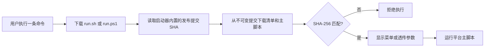
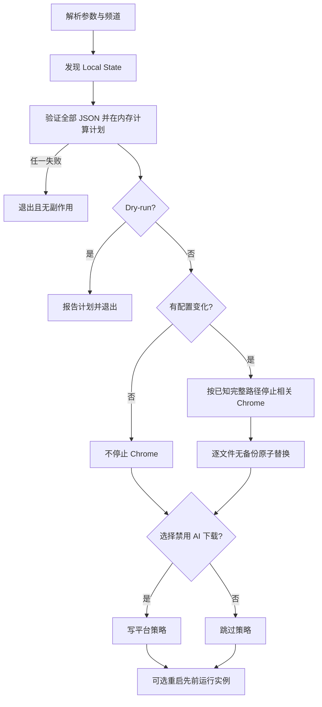
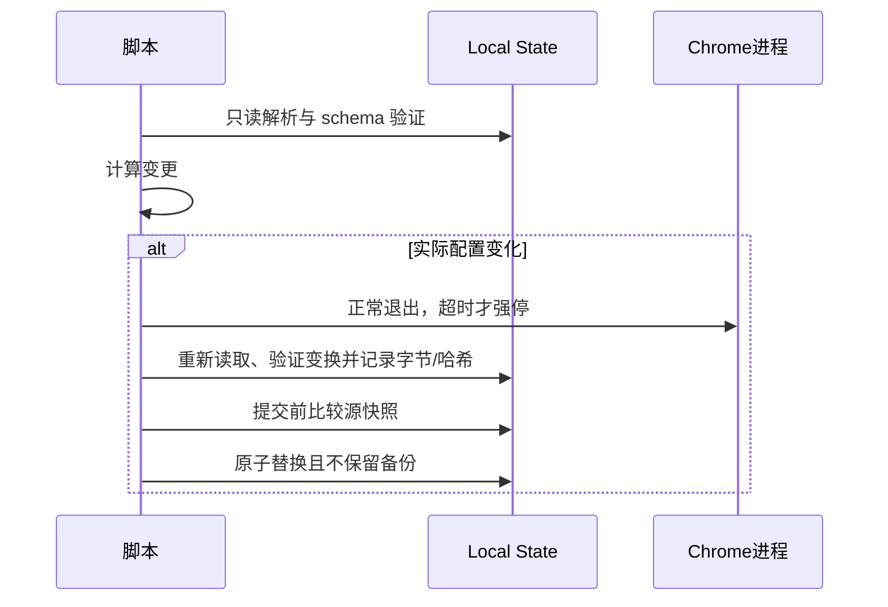

# 流程图

返回 [[index]]。

## 一条命令启动

```mermaid
flowchart LR
    U[用户执行一条命令] --> R[下载 run.sh 或 run.ps1]
    R --> A[读取启动器内置的发布提交 SHA]
    A --> D[从不可变提交下载清单和主脚本]
    D --> H{SHA-256 匹配?}
    H -->|否| X[拒绝执行]
    H -->|是| M[显示菜单或透传参数]
    M --> P[运行平台主脚本]
```

## 主脚本流程

```mermaid
flowchart TD
    A[解析参数与频道] --> B[发现 Local State]
    B --> C[验证全部 JSON 并在内存计算计划]
    C -->|任一失败| X[退出且无副作用]
    C --> D{Dry-run?}
    D -->|是| Y[报告计划并退出]
    D -->|否| E{有配置变化?}
    E -->|是| F[按已知完整路径停止相关 Chrome]
    E -->|否| H[不停止 Chrome]
    F --> G[逐文件无备份原子替换]
    H --> I{选择禁用 AI 下载?}
    G --> I
    I -->|是| J[写平台策略]
    I -->|否| K[跳过策略]
    J --> L[可选重启先前运行实例]
    K --> L
```

```mermaid
sequenceDiagram
    participant S as 脚本
    participant L as Local State
    participant C as Chrome进程
    S->>L: 只读解析与 schema 验证
    S->>S: 计算变更
    alt 实际配置变化
      S->>C: 正常退出，超时才强停
      S->>L: 重新读取、验证变换并记录字节/哈希
      S->>L: 提交前比较源快照
      S->>L: 原子替换且不保留备份
    end
```

代码定位见 [[code-map]]。
